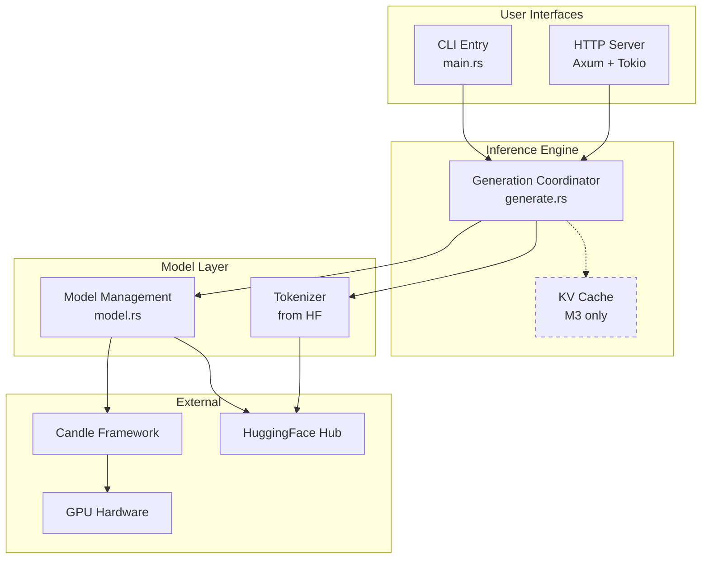
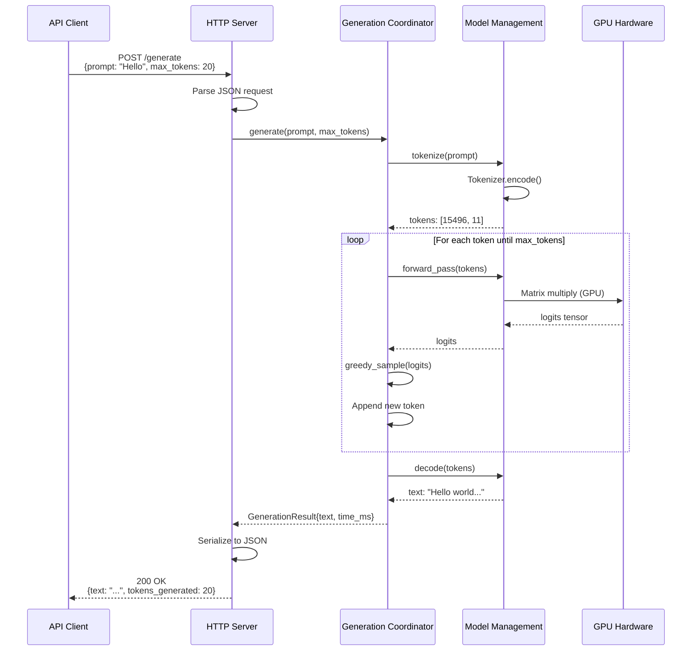
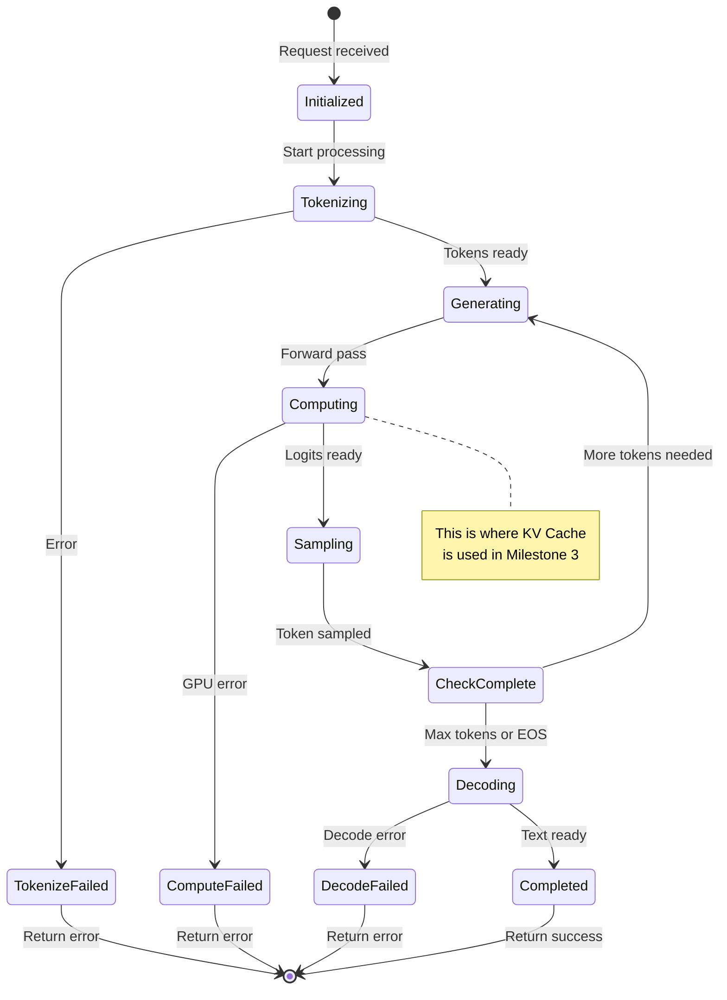
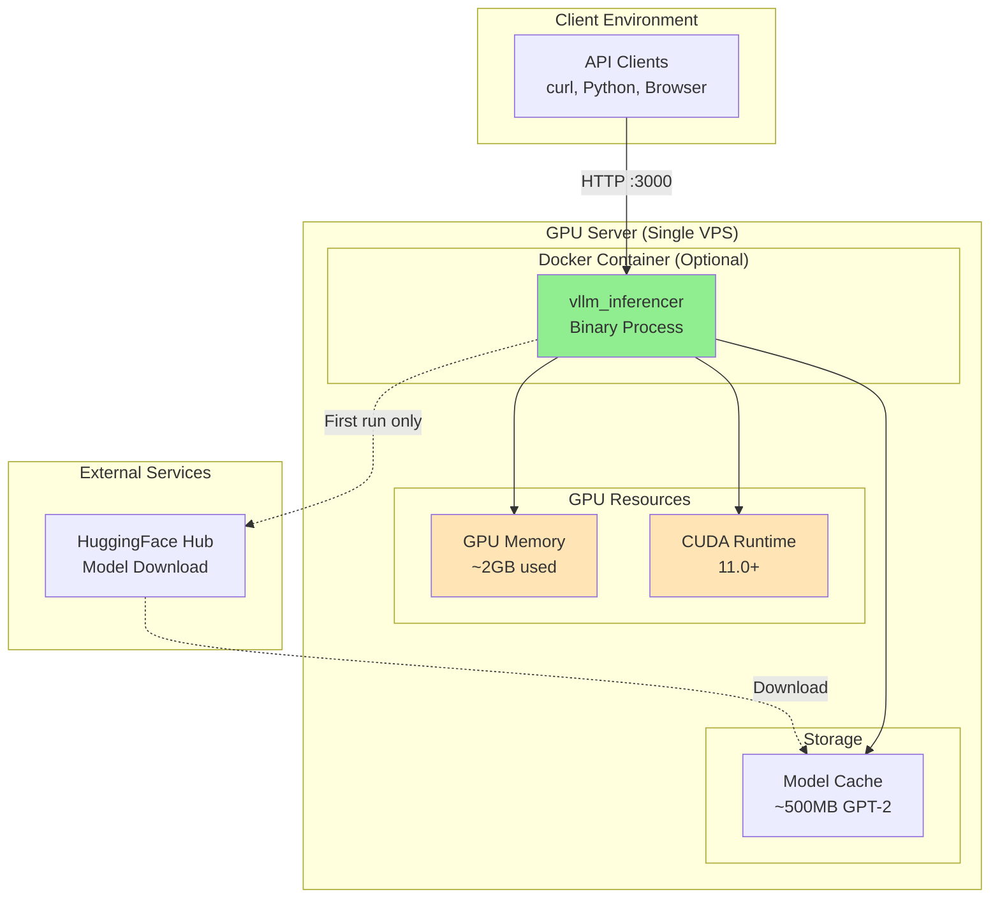
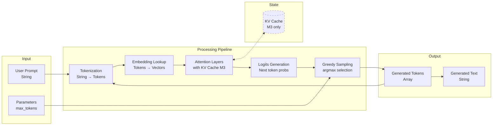

# spec

- **Project Name:** vllm_inferencer
- **Version:** 0.1
- **Date:** 2025-10-21
- **Type:** System Specification (Ultra-Minimal MVP)
- **Scope:** Milestone 1-3 (CLI Generation, HTTP API, KV Cache Optimization)

---

## Table of Contents

1. [Vocabulary](#vocabulary)
2. [Project Goal](#project-goal)
3. [Problem Solved](#problem-solved)
4. [User Stories](#user-stories)
5. [System Actors](#system-actors)
6. [Functional Requirements](#functional-requirements)
7. [Non-Functional Requirements](#non-functional-requirements)
8. [System Architecture](#system-architecture)
9. [Component Diagrams](#component-diagrams)
10. [External Dependencies](#external-dependencies)
11. [Technology Stack](#technology-stack)
12. [In Scope](#in-scope)
13. [Out of Scope](#out-of-scope)
14. [Limitations](#limitations)
15. [Deliverables](#deliverables)
16. [Success Metrics](#success-metrics)
17. [Milestones](#milestones)
18. [Appendix: Addendum](#appendix-addendum)

---

## Vocabulary

This section defines the Ubiquitous Language for the vllm_inferencer project. All terms must be used consistently throughout the specification, source code, and project communications.

- **Inference:** The process of using a trained Large Language Model to generate predictions or text outputs based on input prompts.
- **Inference Engine:** The core system component responsible for executing the Inference process, including tokenization, model forward pass, and token generation.
- **Token:** The atomic unit of text processing in language models. A single word or subword unit produced by the Tokenizer.
- **Tokenizer:** A component that converts raw text (strings) into sequences of Tokens that the Model can process, and converts Tokens back to text.
- **Model:** The pre-trained Large Language Model neural network containing learned parameters (weights). For MVP, specifically GPT-2 Small (124M parameters).
- **Generation:** The iterative process of producing output Tokens one at a time based on a Prompt and previously generated Tokens.
- **Prompt:** The input text string provided by the API Client to initialize the Generation process.
- **Greedy Sampling:** A simple Generation strategy that always selects the Token with the highest probability at each step. Produces deterministic outputs.
- **KV Cache:** Key-Value Cache. A memory optimization that stores intermediate attention computations from previous Tokens to avoid recomputation during Generation, providing 5-10x speedup.
- **API Client:** Any external system or user that sends HTTP requests to the Inference Engine HTTP Server to perform Inference.
- **HTTP Server:** The web service component that exposes the Inference Engine functionality via RESTful HTTP endpoints.
- **GPU (Graphics Processing Unit):** Hardware accelerator used to execute Model computations. Required for practical Inference performance.
- **CUDA:** NVIDIA's parallel computing platform and programming model for GPU acceleration.
- **Candle:** The Rust machine learning framework by HuggingFace used to implement the Inference Engine.
- **SafeTensors:** A secure file format for storing and loading Model weights/parameters.
- **HuggingFace Hub:** Online repository hosting pre-trained Models and Tokenizers. Source for GPT-2 Small in MVP.
- **Max Tokens:** Parameter limiting the maximum number of Tokens to generate during a single Inference request.
- **Sequence Length:** The total number of Tokens in a Prompt plus generated Tokens.

---

## Project Goal

**Prove Candle framework works for LLM inference in 1 week.**

Load GPT-2 Small to GPU, generate coherent text from a prompt, print to console. That's it. No HTTP, no optimization, no complexity. Just validate the core technical stack works before investing in anything else.

---

## Problem Solved

**Risk Validation:** Is Candle mature enough for LLM inference, or should we use PyTorch?

Answer this question in 1 week with working code, not months of planning. If Candle works: great, continue. If not: pivot to PyTorch immediately.

---

## User Stories

### US-1: Developer - Technical Validation
**As a** Developer
**I want** to run a CLI command and see generated text
**So that** I know Candle framework is viable for this project

That's the only user story. Everything else is future work.

---

## System Actors

1. **Developer** - Runs CLI, views generated text
2. **Inference Engine** - Loads model, generates text
3. **HuggingFace Hub** - Provides GPT-2 model files
4. **GPU** - Executes model computations

---

## Functional Requirements

### Public Contract (Mandatory Requirements)

#### FR-1: Load GPT-2 to GPU
**Requirement:** The system **must** load GPT-2 Small from HuggingFace Hub to GPU memory.

**Test:** Run `nvidia-smi`, see ~500MB-2GB allocated.

---

#### FR-2: Generate Text from Prompt
**Requirement:** The system **must** generate text given a prompt string.

**Test:** Run with prompt "Hello", get coherent continuation.

---

#### FR-3: CLI Interface
**Requirement:** The system **must** accept `--prompt` argument and print generated text.

**Test:** `cargo run -- --prompt "Test"` prints generated text to stdout.

---

### Internal Design (Design Recommendations)

These recommendations suggest implementation approaches for internal components. The implementation **may** vary based on developer judgment and technical constraints.

#### DR-1: Model Loading Architecture
**Recommendation:** It is **recommended** that Model loading be implemented in a dedicated `model.rs` module with the following responsibilities:
- Download Model files from HuggingFace Hub using `hf-hub` crate
- Parse SafeTensors format using `safetensors` crate
- Load Model weights into Candle `VarBuilder` on GPU device
- Validate Model architecture matches GPT-2 Small configuration
- Expose `ModelLoader::load()` API returning loaded Model instance

**Rationale:** Separation of concerns allows Model loading logic to evolve independently from Generation logic.

---

#### DR-2: Generation Loop Structure
**Recommendation:** The Generation loop **should** be implemented as an iterative process:
1. Tokenize Prompt to initial Token sequence
2. For each step until Max Tokens or EOS:
   - Run Model forward pass on current Token sequence (or last Token if using KV Cache)
   - Extract logits for next Token position
   - Apply Greedy Sampling (select argmax)
   - Append selected Token to sequence
   - Update KV Cache with new key/value tensors
3. Decode final Token sequence to text string

**Rationale:** This structure is standard for autoregressive Generation and maps cleanly to Candle's tensor operations.

---

#### DR-3: HTTP Server Framework
**Recommendation:** The HTTP server **should** use Axum framework with Tokio async runtime for the following reasons:
- Axum provides ergonomic routing and JSON serialization
- Tokio async runtime enables future concurrent request handling (post-MVP)
- Ecosystem maturity and strong Rust community support

**Alternative:** If Axum proves problematic, Actix-web is an acceptable alternative with similar capabilities.

---

#### DR-4: Error Handling Pattern
**Recommendation:** All error types **should** be defined using `error_tools` crate following workspace standard conventions:
- Create `error.rs` module with `InferenceError` enum
- Variants for `ModelLoadingError`, `TokenizationError`, `GenerationError`, `HttpError`
- Use `thiserror::Error` derive macro (re-exported from `error_tools`)
- Implement `From` conversions for underlying library errors

**Rationale:** Consistent error handling pattern across workspace crates, required by project rulebooks.

---

## Non-Functional Requirements

#### NFR-1: It Must Work
**Requirement:** Text generation **must** produce coherent output (manual evaluation - does it look like English?).

#### NFR-2: No Crashes
**Requirement:** System **must** complete 10 generations without crashing.

#### NFR-3: GPU Usage
**Requirement:** Model **must** run on GPU (verify with nvidia-smi showing memory usage).

---

## System Architecture

### Overview

The vllm_inferencer system is a single-process Rust application that loads a pre-trained GPT-2 Small Model to GPU memory and exposes text Generation capabilities through both CLI and HTTP interfaces.

**Architecture Style:** Layered monolithic application with clear separation between:
1. **Interface Layer:** CLI and HTTP API entry points
2. **Inference Engine Layer:** Core Generation logic and KV Cache management
3. **Model Layer:** Model loading and forward pass execution
4. **Integration Layer:** External dependencies (Candle, Tokenizers, HuggingFace Hub)

### High-Level Components

```
┌─────────────────────────────────────────────────────────────────┐
│                         User Interfaces                         │
│                                                                 │
│   ┌──────────────┐                  ┌────────────────────────┐ │
│   │  CLI Entry   │                  │  HTTP Server (Axum)    │ │
│   │  (main.rs)   │                  │  POST /generate        │ │
│   │              │                  │  GET /health           │ │
│   └──────┬───────┘                  └───────────┬────────────┘ │
│          │                                      │              │
└──────────┼──────────────────────────────────────┼──────────────┘
           │                                      │
           │         ┌───────────────────────────┘
           │         │
           ▼         ▼
┌─────────────────────────────────────────────────────────────────┐
│                      Inference Engine                           │
│                                                                 │
│   ┌──────────────────────────────────────────────────────────┐ │
│   │  Generation Coordinator (generate.rs)                    │ │
│   │  - Orchestrates tokenization → forward pass → sampling  │ │
│   │  - Manages KV Cache lifecycle                           │ │
│   │  - Implements Greedy Sampling                           │ │
│   └──────────┬───────────────────────────────┬───────────────┘ │
│              │                               │                 │
└──────────────┼───────────────────────────────┼─────────────────┘
               │                               │
               ▼                               ▼
┌──────────────────────────┐    ┌─────────────────────────────────┐
│   Model Management       │    │   KV Cache (Milestone 3)        │
│   (model.rs)             │    │   - Key tensor storage          │
│                          │    │   - Value tensor storage        │
│  - Model loading         │    │   - Cache update logic          │
│  - HuggingFace Hub API   │    │   - Memory management           │
│  - SafeTensors parsing   │    └─────────────────────────────────┘
│  - GPU memory alloc      │
│  - Forward pass          │
└──────────┬───────────────┘
           │
           ▼
┌─────────────────────────────────────────────────────────────────┐
│                   External Dependencies                         │
│                                                                 │
│  ┌──────────────┐  ┌────────────┐  ┌────────────────────────┐ │
│  │   Candle     │  │ Tokenizers │  │  HuggingFace Hub API   │ │
│  │   (GPU ops)  │  │   (UTF-8)  │  │  (model download)      │ │
│  └──────────────┘  └────────────┘  └────────────────────────┘ │
└─────────────────────────────────────────────────────────────────┘
                           │
                           ▼
                  ┌────────────────┐
                  │  GPU Hardware  │
                  │  (CUDA/NVIDIA) │
                  └────────────────┘
```

### Milestone Evolution

**Milestone 1 (CLI):**
- Components: CLI Entry + Inference Engine + Model Management + Candle/Tokenizers
- No HTTP Server, no KV Cache
- Single-threaded execution

**Milestone 2 (HTTP API):**
- Add: HTTP Server (Axum) with `/generate` and `/health` endpoints
- Sequential request processing (queue-based)
- Still no KV Cache

**Milestone 3 (KV Cache):**
- Add: KV Cache component
- Modify: Generation Coordinator to use cached attention computations
- 5-10x speedup expected

---

## Component Diagrams

### Diagram 1: Component Structure

This diagram shows the static structure of system components and their dependencies.



**Legend:**
- Solid arrows: Direct dependencies
- Dashed arrows: Optional dependency (Milestone 3 only)
- M3: Milestone 3

---

### Diagram 2: Request Processing Sequence (HTTP API)

This sequence diagram shows the flow of a single HTTP Generation request through the system.



**Notes:**
- In Milestone 1 (CLI), replace `Client` and `HTTP Server` with `CLI User` and `CLI Entry`
- In Milestone 3, add `KV Cache` actor with cache lookup/update steps in the generation loop

---

### Diagram 3: Generation State Machine

This state diagram shows the lifecycle of a single text Generation request.



---

### Diagram 4: Deployment Architecture

This diagram shows the runtime deployment of the MVP system.



**Infrastructure Notes:**
- Single VPS with GPU (e.g., vast.ai, runpod.io, Lambda Labs)
- Minimum: RTX 3060 (8GB VRAM), 16GB RAM, 20GB storage
- Estimated cost: $50-100/month for GPU-enabled VPS
- No auto-scaling, no load balancer (ultra-minimal MVP)

---

### Diagram 5: Data Flow (Token Generation)

This data flow diagram shows how information moves through the system during text Generation.



**Data Flow Notes:**
- Feedback loop: Generated tokens are fed back into embedding layer for next iteration
- KV Cache (dashed) is optional in M1-M2, required in M3
- All tensor operations execute on GPU

---

## External Dependencies

This section documents all external services and libraries that the Inference Engine relies upon.

### Dependency 1: HuggingFace Hub

- **Service Name:** HuggingFace Model Hub
- **Purpose:** Download pre-trained GPT-2 Small Model files and Tokenizer configuration during initialization
- **API Type:** REST API (HTTPS)
- **Access Method:** Public API, no authentication required for public models
- **Required Endpoints/Operations:**
  - Model file downloads: `https://huggingface.co/gpt2/resolve/main/model.safetensors`
  - Tokenizer files: `https://huggingface.co/gpt2/resolve/main/tokenizer.json`
  - Configuration files: `https://huggingface.co/gpt2/resolve/main/config.json`

**Risk Assessment:**
- **Availability Impact:** HIGH - If HuggingFace Hub is unavailable, system cannot download Model on first run. Mitigation: Cache downloaded files locally, support offline mode after initial download.
- **Performance Impact:** MEDIUM - Network download adds 5-30 seconds to cold start time. Mitigation: Implement local cache, pre-download models during deployment.
- **Security Considerations:** LOW - Downloading from public repository. Mitigation: Verify file checksums against known values.
- **Cost Model:** FREE - Public models have no API costs. Risk: None for MVP.

---

### Dependency 2: Candle Framework

- **Library Name:** candle-core, candle-nn, candle-transformers
- **Purpose:** Execute GPU-accelerated tensor operations for Model inference
- **Version:** 0.8.x
- **Integration Method:** Rust crate dependency via Cargo.toml
- **Required Features:** CUDA support enabled

**Risk Assessment:**
- **Availability Impact:** CRITICAL - Core framework for all Model operations. No fallback. Mitigation: Pin to specific tested version (0.8.x).
- **Performance Impact:** CRITICAL - All performance depends on Candle's GPU kernel efficiency. Mitigation: Benchmark early, validate GPU utilization.
- **Maturity Risk:** MEDIUM - Candle is relatively new (2023-2024). May have undiscovered bugs. Mitigation: Extensive testing, community engagement, fallback to PyTorch if critical issues found.
- **API Stability:** MEDIUM - API may change between versions. Mitigation: Pin to specific version, test updates carefully.

---

### Dependency 3: Tokenizers Library

- **Library Name:** tokenizers (HuggingFace Rust tokenizers)
- **Purpose:** Text tokenization and detokenization using GPT-2 vocabulary
- **Version:** 0.15.x
- **Integration Method:** Rust crate dependency

**Risk Assessment:**
- **Correctness Impact:** CRITICAL - Incorrect tokenization breaks Generation quality. Mitigation: Validation tests against HuggingFace `transformers` Python library.
- **Performance Impact:** LOW - Tokenization is fast (<10ms). Not a bottleneck.
- **Compatibility:** HIGH confidence - Official HuggingFace library, widely used.

---

### Dependency 4: Axum HTTP Framework

- **Library Name:** axum (with tokio runtime)
- **Purpose:** HTTP server for API endpoints (Milestone 2+)
- **Version:** 0.7.x
- **Integration Method:** Rust crate dependency

**Risk Assessment:**
- **Availability Impact:** MEDIUM - Only affects HTTP mode, CLI still works. Mitigation: Well-tested framework, stable API.
- **Performance Impact:** LOW - Minimal overhead (<10ms per request). Mitigation: Benchmark to confirm.
- **Alternative:** Actix-web can be substituted if Axum proves problematic.

---

## Technology Stack

### Core Technologies

| Component | Technology | Version | Rationale |
|-----------|-----------|---------|-----------|
| **Programming Language** | Rust | 1.70+ | Memory safety, performance, zero-cost abstractions |
| **ML Framework** | Candle | 0.8.x | Pure Rust, GPU support, HuggingFace compatibility |
| **GPU Runtime** | CUDA | 11.0+ | NVIDIA GPU acceleration |
| **HTTP Server** | Axum | 0.7.x | Modern async framework, ergonomic API |
| **Async Runtime** | Tokio | 1.x | Industry standard for async Rust |
| **Serialization** | Serde | 1.x | JSON request/response handling |
| **Error Handling** | error_tools | 0.35.x | Workspace standard (rulebook requirement) |
| **CLI Parsing** | clap | 4.x | Derive-based CLI argument parsing |

### Development Tools

| Tool | Purpose |
|------|---------|
| **cargo nextest** | Parallel test execution |
| **clippy** | Linting and code quality |
| **nvidia-smi** | GPU monitoring and profiling |

---

## In Scope

**ONE THING:** CLI program that generates text.

Features:
- Load GPT-2 Small to GPU
- Take text prompt as input
- Generate text (greedy sampling)
- Print to console

That's it. Period.

---

## Out of Scope

Everything not listed in "In Scope":

- ❌ HTTP API (add later if CLI works)
- ❌ KV Cache optimization (add later if needed)
- ❌ Advanced sampling (temperature, top-p, etc.)
- ❌ Concurrent requests
- ❌ Batching
- ❌ Streaming
- ❌ Monitoring/metrics
- ❌ Larger models
- ❌ Quantization
- ❌ Everything else

**Philosophy:** Build the simplest thing that proves Candle works. Add features ONLY if MVP succeeds.

---

## Limitations

This section quantifies the expected performance and capacity boundaries of the ultra-minimal MVP.

### Performance Limitations

1. **Maximum Concurrent Users:** 1 (sequential request processing only)
2. **Maximum Requests Per Second:** ~0.2-1.0 RPS (depending on Generation length)
3. **Generation Latency:**
   - Milestone 1-2 (no KV Cache): ~5 seconds for 50 tokens
   - Milestone 3 (with KV Cache): ~0.5-1.0 seconds for 50 tokens
4. **Maximum Sequence Length:** 1024 tokens (GPT-2 context window limit)
5. **Maximum Tokens Per Request:** 512 tokens (configurable, but limited by GPU memory and time constraints)

### Resource Limitations

1. **GPU Memory Usage:** ~2GB maximum (Model + KV Cache + activations)
2. **Minimum GPU Requirements:** NVIDIA RTX 3060 or equivalent (8GB VRAM, CUDA 11.0+)
3. **CPU Requirements:** 4 cores, 16GB RAM (for system overhead)
4. **Storage Requirements:** 20GB (Model files ~500MB + OS + application)
5. **Network Bandwidth:** ~1-2 GB for initial Model download (one-time)

### Functional Limitations

1. **Supported Models:** GPT-2 Small only (124M parameters)
2. **Sampling Methods:** Greedy Sampling only (no randomness)
3. **Output Format:** Plain text only (no structured output)
4. **Error Recovery:** No automatic retry or fallback mechanisms
5. **Monitoring:** Manual GPU monitoring only (no integrated metrics)

### Operational Limitations

1. **Availability:** Single point of failure (one server, one process)
2. **Durability:** No request persistence (in-memory queue only)
3. **Scalability:** Vertical scaling only (cannot add more servers)
4. **Maintenance:** Requires server restart for updates (no zero-downtime deployment)

**Acceptance Criteria:** All limitations **must** be validated during Milestone 3 testing and documented in final deployment guide.

---

## Deliverables

1. **CLI Binary:** `cargo build --release` produces working executable
2. **Source Code:** All Rust files in git repository
3. **Proof:** Screenshot or recording of text generation working

That's all. No documentation needed for a proof-of-concept.

---

**Note:** This deliverables list contains only final project outcomes. Internal project artifacts (specifications, roadmaps, meeting notes) are not included as they are project management tools, not client deliverables.

---

## Success Metrics

**ONE metric:** Does text appear when I run the CLI?

```bash
$ cargo run -- --prompt "Once upon a time"
> Once upon a time, there was a wizard who lived in a castle...

✅ SUCCESS
```

If it crashes or generates gibberish: ❌ FAILURE (try different approach)

That's it. No complex metrics needed for proof-of-concept.

---

## Milestones

### Single Milestone: Prove It Works

**Duration:** 3-5 days (not weeks!)

**Goal:** Run CLI, generate text, celebrate.

**Tasks:**
1. Day 1-2: Get Candle examples working, understand API
2. Day 3-4: Load GPT-2, make forward pass work
3. Day 5: Wire up CLI, generate text, test

**Success:** Text appears. It looks like English. GPU was used. Done.

**If this fails:** Consider PyTorch instead of Candle.
**If this succeeds:** Consider adding HTTP API as Milestone 2.

---

## Appendix: Addendum

This addendum provides developer-focused implementation guidance, validation checklists, and references.

### Conformance Checklist

**MVP Checklist - Keep it Simple:**

| Status | Item | Verification |
|--------|------|-------------|
| ❌ | FR-1: Load GPT-2 to GPU | Run nvidia-smi, see memory allocated |
| ❌ | FR-2: Generate Text | Run CLI, see coherent text output |
| ❌ | FR-3: CLI Works | `cargo run -- --prompt "Test"` succeeds |
| ❌ | US-1: Prove Candle Works | Demo working text generation |

**Done when:** All 4 items checked ✅

**Timeline:** 3-5 days max

---

### Testing Strategy

#### Automated Tests

**Location:** `tests/` directory at project root

**Test Files:**
1. `tests/basic_tests.rs` - Tokenization correctness, Model loading, basic generation
2. `tests/http_api_tests.rs` (M2+) - HTTP endpoint validation
3. `tests/cache_tests.rs` (M3) - KV Cache correctness and performance

**Execution:** `w3 .test l::3` (or `make ctest3`)

**Requirements:**
- All tests **must** pass before merge to main branch
- Tests **must** run on GPU-enabled CI environment (or skip with clear warnings)

#### Manual Testing

**Location:** `tests/readme.md`

**Required Manual Tests:**
1. **Text Coherence:** Generate text for 10 diverse prompts, manually evaluate quality
2. **GPU Utilization:** Monitor nvidia-smi during generation, verify >60% GPU usage
3. **Memory Profiling:** Run 100 sequential requests, verify no memory leaks
4. **End-to-End Deployment:** Deploy to fresh VPS, verify service starts and responds

**Documentation:** All manual test procedures **must** be documented in `tests/readme.md` with expected results.

---

### Development Environment Setup

#### Prerequisites

1. **Hardware:**
   - NVIDIA GPU (RTX 3060 or better, 8GB+ VRAM)
   - 16GB+ RAM
   - 20GB+ free storage

2. **Software:**
   - Ubuntu 20.04+ or equivalent Linux
   - CUDA 11.0+ installed (nvidia-smi available)
   - Rust 1.70+ (via rustup)
   - Git

#### Setup Steps

```bash
# 1. Clone repository
git clone <repository-url>
cd vllm_inferencer

# 2. Verify CUDA
nvidia-smi  # Should show GPU and CUDA version

# 3. Build project
cargo build --release

# 4. Run tests
w3 .test l::3  # Or: make ctest3

# 5. Test CLI
cargo run --release -- --prompt "Hello world" --max-tokens 20

# 6. Test HTTP (M2+)
cargo run --release &
curl -X POST http://localhost:3000/generate \
  -H "Content-Type: application/json" \
  -d '{"prompt": "Test", "max_tokens": 10}'
```

---

### Architecture Decision Records

#### ADR-1: Single-Crate Structure

**Decision:** Use single Rust crate (not workspace) for MVP

**Rationale:**
- Project scope limited (<1000 LOC)
- No independent components requiring separate crates
- Simpler build and dependency management
- Can refactor to workspace when adding 2nd crate (e.g., dataset tools)

**Status:** Accepted

---

#### ADR-2: Greedy Sampling Only

**Decision:** Implement only Greedy Sampling (argmax) in MVP, defer temperature/top-p/top-k to future versions

**Rationale:**
- Greedy sampling is deterministic, simplifying testing
- Simplest implementation (single line: `argmax(logits)`)
- Sufficient to prove technical feasibility
- Advanced sampling adds complexity without validating core concepts

**Status:** Accepted

---

#### ADR-3: Sequential Request Processing

**Decision:** Process HTTP requests one-at-a-time in FIFO queue, no concurrency in MVP

**Rationale:**
- Concurrent batching adds significant complexity (request grouping, padding, dynamic batch sizing)
- MVP goal is proof-of-concept, not production throughput
- Single-request processing sufficient for testing and validation
- Can add concurrency in future milestones after core functionality validated

**Status:** Accepted

---

### Performance Benchmarking Guide

#### Baseline Measurements (Milestone 1-2)

**Test Configuration:**
- Model: GPT-2 Small
- GPU: RTX 3060
- Prompt: "Once upon a time"
- Max Tokens: 50

**Metrics to Capture:**
1. **Model Loading Time:** From process start to first generation ready
2. **Time Per Token:** Total generation time / number of tokens generated
3. **GPU Memory Usage:** Peak VRAM during generation (via nvidia-smi)
4. **GPU Utilization:** % GPU usage during forward pass (via nvidia-smi)

**Baseline Expectations:**
- Loading Time: 5-10 seconds
- Time Per Token (no cache): ~100ms
- GPU Memory: 500MB-2GB
- GPU Utilization: 40-80%

#### KV Cache Validation (Milestone 3)

**Test Procedure:**
1. Run 20 generations WITHOUT KV Cache, record average time-per-token
2. Run 20 generations WITH KV Cache, record average time-per-token
3. Calculate speedup ratio: baseline_time / cache_time
4. Verify speedup is between 5x and 10x

**Correctness Validation:**
1. Generate text for 10 test prompts with and without KV Cache
2. Compare outputs character-by-character
3. Verify all outputs match exactly (no numerical drift)

---

### Reference Links

1. **Candle Documentation:** https://github.com/huggingface/candle
2. **GPT-2 Model Card:** https://huggingface.co/gpt2
3. **Tokenizers Library:** https://github.com/huggingface/tokenizers
4. **Axum Framework:** https://docs.rs/axum/latest/axum/
5. **Project Rulebooks:** `/home/user1/pro/genai/code/rules/`

---

### Glossary Cross-Reference

All terms defined in [Vocabulary](#vocabulary) section **must** be used consistently:

| Term | Used In Sections |
|------|-----------------|
| Inference | Project Goal, Functional Requirements, System Architecture |
| Token | Vocabulary, FR-2, FR-3, NFR-2, NFR-3 |
| Tokenizer | Vocabulary, FR-2, External Dependencies |
| KV Cache | Vocabulary, FR-7, NFR-3, Milestone 3, Diagrams |
| Prompt | Vocabulary, User Stories, FR-4, FR-5, Diagrams |
| API Client | Vocabulary, System Actors, FR-5 |
| Model | Throughout specification |

---

### Open Questions & Risks

#### Open Questions

1. **Q:** Should we support FP16 precision in MVP to reduce memory usage?
   - **Impact:** MEDIUM - Could allow larger batch sizes (future)
   - **Resolution:** DEFERRED - Use FP32 for MVP, validate correctness first

2. **Q:** Should health check endpoint include GPU status (VRAM usage, temperature)?
   - **Impact:** LOW - Nice-to-have for monitoring
   - **Resolution:** NOT IN MVP - Add in future monitoring milestone

#### Known Risks

| Risk | Probability | Impact | Mitigation |
|------|-------------|--------|------------|
| Candle framework has critical bugs | MEDIUM | HIGH | Extensive testing in M1, fallback to PyTorch if needed |
| GPT-2 generation quality poor | LOW | MEDIUM | Validate against HuggingFace reference, not a blocker for MVP |
| KV Cache implementation complex | MEDIUM | MEDIUM | Allocate extra time in M3, simplify if needed |
| GPU availability during development | LOW | HIGH | Use cloud GPU providers (vast.ai, runpod.io) as backup |
| Model download failures (network) | LOW | LOW | Implement retry logic, support local model files |

---

### File Structure Reference

**Final Project Structure:**
```
vllm_inferencer/
├── Cargo.toml              # Rust project manifest
├── readme.md               # Project onboarding
├── spec.md                 # This specification (DELIVERABLE: NO)
├── decisions.md            # Auto-decisions log (DELIVERABLE: NO)
├── Makefile                # Build automation (ctest1, ctest3)
├── .gitignore              # Git exclusions
├── secret/
│   ├── readme.md           # Secret management guide
│   └── -hf_token.sh        # HuggingFace token (optional, gitignored)
├── src/
│   ├── main.rs             # Entry point (CLI + HTTP)
│   ├── lib.rs              # Public API
│   ├── model.rs            # Model loading and forward pass
│   ├── generate.rs         # Generation logic and KV Cache
│   └── error.rs            # Error types (error_tools)
└── tests/
    ├── readme.md           # Manual testing plan
    ├── basic_tests.rs      # Model loading, tokenization, generation
    ├── http_api_tests.rs   # HTTP endpoint tests (M2+)
    └── cache_tests.rs      # KV Cache tests (M3)
```

**Note:** `spec.md` and `decisions.md` are project management artifacts, **NOT** client deliverables (see Deliverables section).

---

**End of Specification**

---
